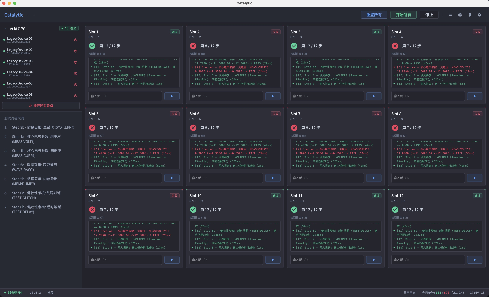
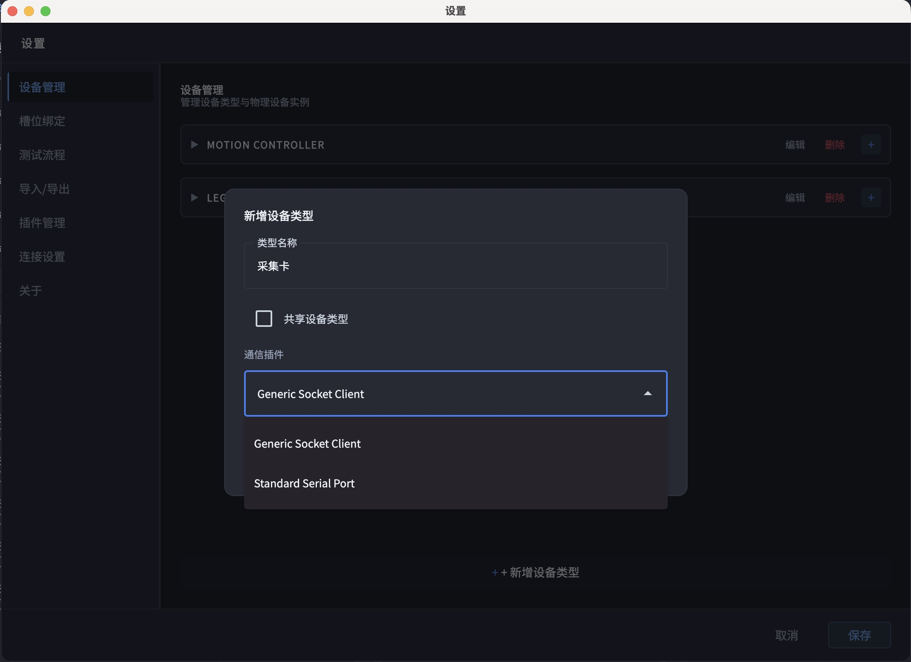
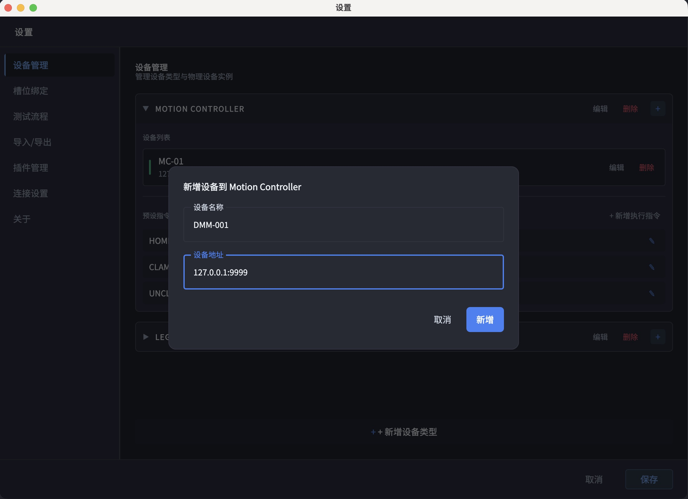
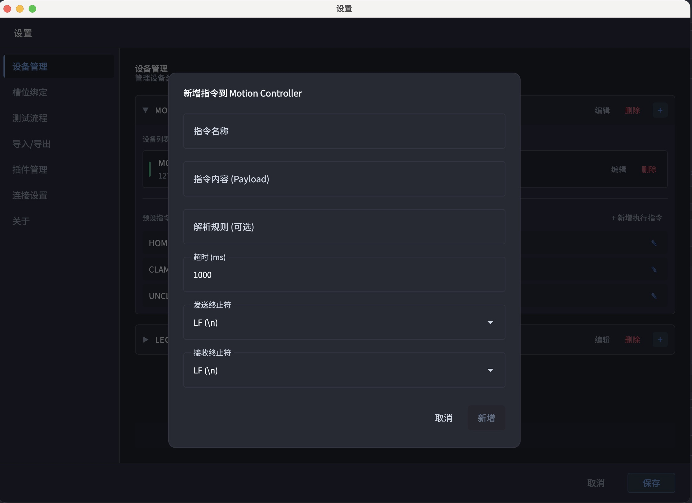
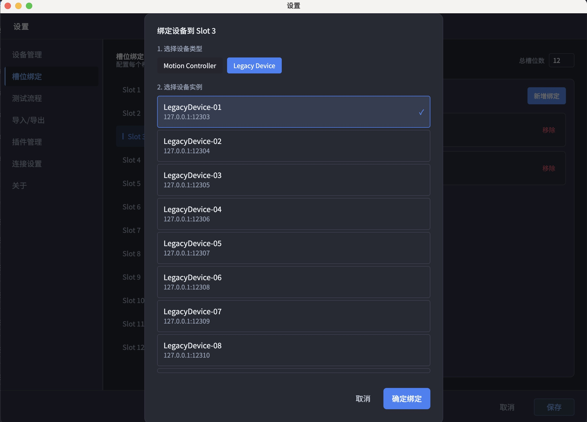
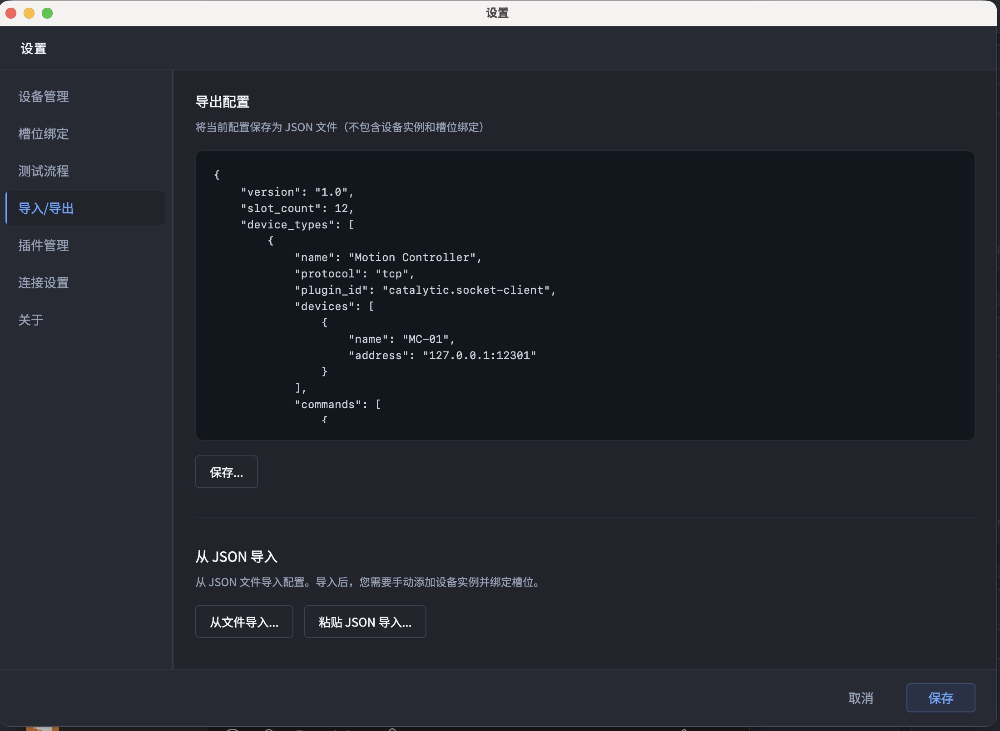

## 🛠️ 开发者资源
如果您需要扩展系统功能，请参考：
- [🔌 插件开发指南](docs/插件开发指南.md)

# Catalytic 如何使用

具体通过 6 个直观步骤，帮助您快速理解并配置软件核心逻辑。

> **🌍 全平台支持**：原生支持 macOS、Linux、Windows (x86_64 / ARM64)。
> **🖥️ 灵活部署**：支持核心与 UI 分离。核心可运行于工控机，通过局域网内的其他电脑或平板（Android/iPadOS）进行远程操控与监控。

## 核心配置流程

---

### Step 0. 插件部署 (物理安装)
**操作要点：** 将插件**整个文件夹**复制到程序运行目录下的 `plugins` 文件夹中。
> [!CAUTION]
> 必须复制整个文件夹（包含其内部所有文件），禁止只复制 DLL/二进制文件。

---

### Step 1. 插件激活 (功能开启)

**操作要点：** 在设置界面确认所需的“通信器”或“处理器”插件显示为“活跃”状态。

---

### Step 2. 定义设备类型 (逻辑抽象)

**操作要点：** 新建设备类型（如 Motion Controller），并为其**绑定一个通信插件**（如 TCP Client）。

---

### Step 3. 接入硬件实例 (物理连接)

**操作要点：** 在设备类型下添加物理设备，配置具体的 IP 地址、端口或 COM 口信息。

---

### Step 4. 编写指令模板 (业务逻辑)

**操作要点：** 编写通用指令模板，支持使用 `{{SLOT_INDEX}}` 等变量实现多工位逻辑复用。

---

### Step 5. 槽位工位绑定 (实例映射)

**操作要点：** 将具体的物理设备实例分配给逻辑上的测试槽位（Slot），建立映射关系。

---

### Step 6. 运行与备份

**操作要点：** 确认所有槽位绑定正确后，即可开始自动化流程。同时支持将全量配置**导出备份**，方便在其他设备上快速复刻环境。

---

